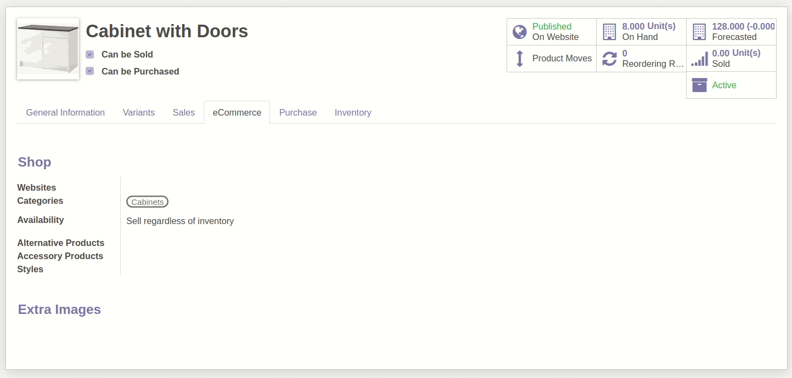

.. image:: https://img.shields.io/badge/licence-AGPL--3-blue.svg
   :target: https://www.gnu.org/licenses/agpl-3.0-standalone.html
   :alt: License: AGPL-3

Website Product Multiwebsite
============================

Permite poder seleccionar en que sitios web se puede vender un producto, o en todos si no indica un sitio web y el producto está publicado. 

Antes de la instalación de este modulo el producto tiene un selector para indicar en que sitio web se expone el producto, pero este sistema no sirve si queremos que el producto esté expuesto en más de un sitio web puesto que es un Many to One. Este modulo lo que hace es convertir este selector en un selector de etiquetas donde puede indicar más de un sitio web. 

